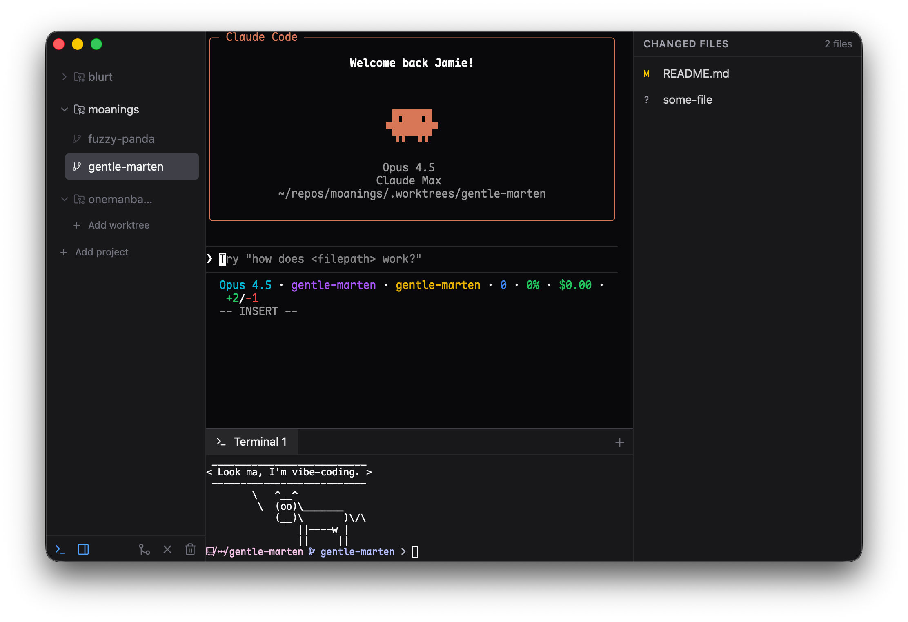

<div align="center">
  

  <h1>One Man Band</h1>

  <p><strong>A GUI git worktree orchestrator for AI-driven development</strong></p>

  <p>
    <a href="https://github.com/shkm/One-Man-Band/releases"></a>
    <a href="https://github.com/shkm/One-Man-Band/blob/main/LICENSE"></a>
    <a href="https://github.com/shkm/One-Man-Band/stargazers"></a>
  </p>

  <p>
    <a href="#features">Features</a> •
    <a href="#installation">Installation</a> •
    <a href="#configuration">Configuration</a> •
    <a href="#development">Development</a>
  </p>
</div>

<br />

<p align="center">
  
</p>

<br />

> [!WARNING]
> This project is in early development. It's written with heavy AI assistance.

## What is this?

This is a git worktree orchestrator, designed for an AI-centric development workflow.

What does that mean? Let's start with the problem.

> LLM development flows involve a lot of waiting

Once an LLM gets going, it could take a while before user input is next required. [It's the new compiling](https://xkcd.com/303/),
where you go do something else for a bit. Stretch your legs, grab a coffee, read a little, interact with coworkers. Please don't stop doing those things — those things are all good and healthy!

But sometimes you want to power through and get more work done. That's where git worktrees come in.

### Git Worktrees

A [git worktree](https://git-scm.com/docs/git-worktree) lets you check out multiple branches in separate directories. This means we can run a separate instance of our LLM of choice in each directory, each contributing to its own feature branch in isolation. They're a perfect fit for LLMs, so their usage is growing by the day.

### Worktree management

But there are a couple of problems. Firstly, you have a bunch of new commands to memorise. Not to worry: aliases to the rescue. But then you notice that worktrees don't include ignored files so those will need to be copied every time one is created. You might need to run a couple of specialised commands per repo — generate some assets, copy a database, etc. Suddenly, creating a worktree becomes more complex.

And what about tasks that should run once per repository? Sure, you could stop and start a web server when you need a preview in a different worktree, but it would be a lot easier to just give each its own port.

Finally, task switching itself can be a chore. One terminal tab per worktree sounds reasonable, but what about additional context? Each workspace has its own changeset to browse, and I often find myself manually running commands.

### Alternatives

So I went looking for other options. [Conductor](https://docs.conductor.build) opened my eyes to how productive a polished workflow around worktrees can be. But I found Conductor a bit too heavy-handed for my uses, so I switched down to [Worktrunk](https://worktrunk.dev). Both fantastic pieces of software, but once again it wasn't a fit — I missed what I could do with a GUI.

### Enter: One Man Band

So that's why I built One Man Band (see what I did there?). Now I can run Claude, or any other terminal-based LLM, without losing the potential of rich GUI interactions. And that potential isn't yet realised, but we're getting there...

## Features

- **Project Management** — Add git repositories and manage multiple worktrees
- **Worktree Orchestration** — Create isolated git worktrees with random names (e.g., "fuzzy-tiger")
  - **Create worktree** — Generates a worktree with a random branch name
  - **Merge worktree** — Merges/rebases, deletes branch + worktree + remote branch (optionally)
- **Configurable Main Command** — Launch Claude, Aider, or any CLI tool in each worktree
- **Change View** — Real-time display of changed files in each worktree
- **Terminal Access** — Shell access in each worktree

...and plenty more to flesh it out properly on the way.

## Keyboard Shortcuts

| Shortcut  | Action                               |
| --------- | ------------------------------------ |
| `Ctrl+\`` | Toggle drawer (terminal panel)       |
| `Cmd+B`   | Toggle right sidebar (changed files) |

Shortcuts can be customized via `mappings` in the [config](#configuration).

## Installation

At the moment, you're best off just running it from source. I'm still working on getting releases with notarization working, but you can check out the [Releases](https://github.com/shkm/One-Man-Band/releases) page.

## Technology Stack

- **Frontend**: React + TypeScript + Tailwind CSS
- **Backend**: Rust (Tauri 2.x)
- **Terminal**: xterm.js
- **Git**: git2 (libgit2 bindings)
- **PTY**: portable-pty

## Development

### Prerequisites

- Node.js 18+
- Rust 1.70+

### Setup

```bash
npm install
npm run tauri dev
```

### Build

```bash
npm run tauri build
```

The built application will be available at:

- `src-tauri/target/release/bundle/macos/One Man Band.app`
- `src-tauri/target/release/bundle/dmg/One Man Band_*.dmg`

## Architecture

```
┌─────────────────────────────────────────────────────────────┐
│  Tauri WebView (React)                                      │
│  ┌────────────┐  ┌───────────────────┐  ┌─────────────────┐ │
│  │  Sidebar   │  │  Main Pane        │  │  Right Panel    │ │
│  │            │  │  (tabbed xterm)   │  │  ┌───────────┐  │ │
│  │ - Projects │  │                   │  │  │ Changed   │  │ │
│  │ - Workspcs │  │                   │  │  │ Files     │  │ │
│  │            │  │                   │  │  ├───────────┤  │ │
│  │            │  │                   │  │  │ Terminal  │  │ │
│  └────────────┘  └───────────────────┘  └─────────────────┘ │
└─────────────────────────────────────────────────────────────┘
                            │
                      Tauri IPC
                            │
┌─────────────────────────────────────────────────────────────┐
│  Rust Backend                                               │
│  ┌──────────────┐  ┌──────────────┐  ┌──────────────┐       │
│  │ WorktreeMgr  │  │   PtyMgr     │  │  FileWatcher │       │
│  └──────────────┘  └──────────────┘  └──────────────┘       │
│         │                                                   │
│  ┌──────────────┐                                           │
│  │    git2      │                                           │
│  └──────────────┘                                           │
└─────────────────────────────────────────────────────────────┘
```

## Data Storage

- **Worktrees**: Created in `<repo>/.worktrees/<worktree-name>/` by default
- **State**: Persisted in `~/.onemanband/state.json`

## Configuration

Settings are stored in `~/.config/onemanband/config.jsonc`. The file is created with defaults on first run.

See [default_config.jsonc](src-tauri/src/default_config.jsonc) for all available options.

### Project-specific overrides

You can override settings per-project by creating config files in the project directory:

- `.onemanband/config.jsonc` — shared with the team (commit to git)
- `.onemanband/config.local.jsonc` — local overrides (add to `.gitignore`)

### Attribution

Drum icon is [CC BY 4.0](https://creativecommons.org/licenses/by/4.0/) [VectorPortal](https://vectorportal.com).

## License

MIT
