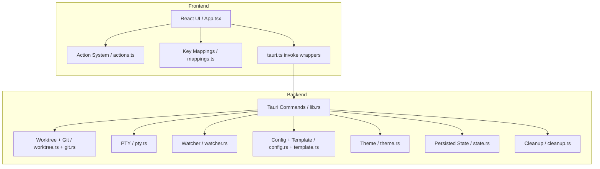
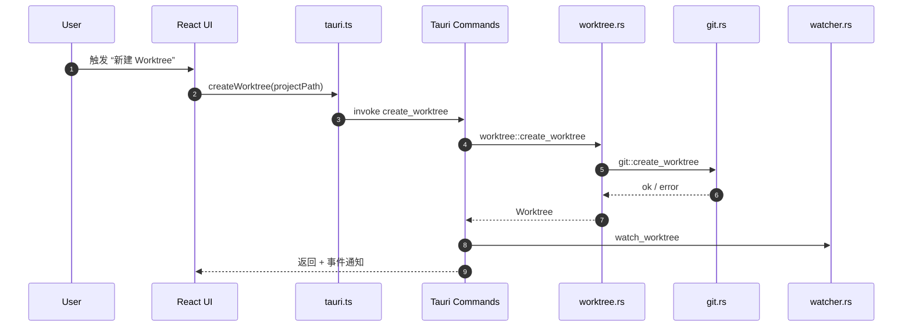

# Shellflow 仓库深度走读报告

> 目标读者：开发/架构（兼顾运维与产品理解）
> 报告时间：2026-02-06

## 01. 项目概览

- 仓库定位：Tauri 桌面应用，用于 Git worktree 编排与多终端协作（React + Rust）。见 `README.md`、`src-tauri/src/main.rs`、`src/main.tsx`。
- 关键目录：
  - `src/`：React 前端（UI、动作系统、Tauri 调用封装）。
  - `src-tauri/`：Rust 后端（Tauri 命令、Git 操作、PTY、Watcher、配置）。
  - `schemas/`：配置 JSON Schema（编辑器提示与校验）。
  - `themes/`：主题资源（运行时读取/扫描）。
  - `.github/workflows/`：CI（前端与 Rust 测试）。
- 技术栈与关键依赖：
  - 前端：React 19 + Vite 7 + Tailwind v4（`package.json`）。
  - 后端：Tauri 2.x + Rust 2021（`src-tauri/Cargo.toml`）。
  - Git：`git2` + `git` CLI（`src-tauri/src/git.rs`）。
  - 终端：`portable-pty`（`src-tauri/src/pty.rs`）。
  - 文件监听：`notify`（`src-tauri/src/watcher.rs`）。
- 运行与构建：`npm install` + `npm run tauri dev`（`README.md`）。

## 02. 架构地图（分层 + 核心对象 + 数据流）

### 模块清单（按目录分组）
- 前端 UI 与动作系统：`src/App.tsx`、`src/lib/actions.ts`、`src/lib/actionHandlers.ts`、`src/lib/mappings.ts`。
- Tauri 调用封装：`src/lib/tauri.ts`。
- 后端命令与主流程：`src-tauri/src/main.rs`、`src-tauri/src/lib.rs`。
- Git/worktree 领域：`src-tauri/src/git.rs`、`src-tauri/src/worktree.rs`。
- 终端/PTY：`src-tauri/src/pty.rs`。
- 文件变更与监听：`src-tauri/src/watcher.rs`。
- 配置/模板/主题：`src-tauri/src/config.rs`、`src-tauri/src/template.rs`、`src-tauri/src/theme.rs`。
- 状态持久化：`src-tauri/src/state.rs`。
- 崩溃清理：`src-tauri/src/cleanup.rs`。

### Mermaid：模块依赖图



## 03. 入口与执行流程（从锚点开始追）

### 锚点选择
选择“创建 Worktree”作为核心锚点：它贯穿 UI 动作系统 → Tauri IPC → Git/Worktree 逻辑 → 文件监听与后续任务。

### 入口点列表（关键）
- 前端入口：`src/main.tsx`（React 渲染 + 日志挂载）。
- 后端入口：`src-tauri/src/main.rs` → `shellflow_lib::run()`（Tauri 启动）
- Tauri 命令注册：`src-tauri/src/lib.rs` 的 `tauri::Builder::default().invoke_handler(...)`。

### 关键链路（Create Worktree）
1) UI 触发动作（命令面板/快捷键/UI 操作）→ 动作系统判断可用性。`src/lib/actions.ts`、`src/lib/actionHandlers.ts`。
2) 通过 Tauri invoke 调用：`src/lib/tauri.ts:createWorktree()` → invoke `create_worktree`。
3) 后端命令入口：`src-tauri/src/lib.rs:create_worktree()`，加载配置并持久化状态，发事件给前端。
4) 业务逻辑：`src-tauri/src/worktree.rs:create_worktree()` → 生成唯一分支名 → 解析目录模板 → `git::create_worktree()`。
5) Git 执行：`src-tauri/src/git.rs:create_worktree()` 用 libgit2 校验无未提交变更 + git CLI `worktree add`。
6) 可选复制忽略文件：`worktree::copy_gitignored_files()`（后台线程 + 事件通知）。
7) 启动文件监听：`src-tauri/src/watcher.rs:watch_worktree()` → `files-changed` 事件。

### Mermaid：创建 Worktree 时序图（简化）



## 04. 核心模块深挖（高杠杆）

### 4.1 Worktree 管理（核心域）
- 概念与职责：生成唯一分支名、解析 worktree 目录、创建/删除 worktree、复制忽略文件。
- 代码定位：`src-tauri/src/worktree.rs`（`create_worktree`, `delete_worktree`, `copy_gitignored_files`）。
- 核心数据结构：`state::Project`、`state::Worktree`（`src-tauri/src/state.rs`）。
- 关键流程/算法：
  - `generate_unique_worktree_name()` 通过 `git::branch_exists` 避免冲突。
  - `resolve_worktree_directory()` 使用模板（minijinja）支持 `{{ repo_directory }}` 等变量。
  - 复制忽略文件时使用 glob 过滤 `except` 模式。
- 扩展点：
  - Worktree 目录模板与过滤器（`template.rs`）。
  - 配置 `worktree.copy.*` 与 `worktree.baseBranch`（`config.rs`, `schemas/config.schema.json`）。
- 最小示例（伪代码）：
  ```text
  createWorktree(projectPath)
    -> worktree::create_worktree
      -> resolve_worktree_directory
      -> git::create_worktree
      -> copy_gitignored_files (optional)
  ```

### 4.2 Git 适配层（libgit2 + CLI）
- 概念与职责：Git 状态/分支/差异计算、合并可行性、worktree 操作封装。
- 代码定位：`src-tauri/src/git.rs`。
- 核心结构：`MergeFeasibility`, `WorktreeDeleteStatus`。
- 关键流程：
  - 创建 worktree 前检查未提交变更（`has_modified_or_staged_changes`）。
  - 选择 base branch（auto/current/named）。
  - 使用 git CLI 执行 `git worktree add` 规避 libgit2 锁问题。
- 扩展点：
  - Merge/Rebase 工作流扩展（`execute_merge_workflow` 在 `lib.rs` 中注册）。

### 4.3 PTY / 终端管理
- 概念与职责：创建并管理 PTY，会话 IO 转发，生命周期与清理。
- 代码定位：`src-tauri/src/pty.rs`。
- 核心数据结构：`PtySession`（`state.rs`），全局 `PTY_WRITERS`/`PTY_MASTERS` 缓存。
- 关键流程：
  - 启动 PTY 时读取用户登录 shell PATH（`get_user_path`），并缓存。
  - `spawn_pty()` 支持 shell override 与命令模式。
  - `cleanup.rs` 在崩溃时清理孤儿进程（PID 文件）。
- 扩展点：
  - 新增命令类型（`spawn_*` 系列命令在 `lib.rs` 注册）。

### 4.4 Watcher / 变更感知
- 概念与职责：监听 worktree 目录和 git index，向前端推送变更。
- 代码定位：`src-tauri/src/watcher.rs`。
- 关键流程：
  - `watch_worktree()` 使用 notify，带 trailing-edge debounce。
  - 额外监听 `.git` 实际目录以捕获 staging 变更。
  - worktree 被外部删除时触发 `worktree-removed` 事件。
- 扩展点：
  - 可增加更多事件类型（如任务状态、外部命令输出等）。

### 4.5 配置与模板系统
- 概念与职责：多层配置合并 + JSONC 解析 + 模板渲染。
- 代码定位：`src-tauri/src/config.rs`、`src-tauri/src/template.rs`。
- 核心流程：
  - config 搜索路径：全局 + repo + local（`get_config_paths`）。
  - JSONC 去注释 + deep merge（数组按 `name` 合并）。
  - 模板过滤器：`sanitize`、`hash_port`、`shell_escape`。
- 扩展点：
  - 新增配置项需同步 `schemas/config.schema.json` 与默认配置。

### 4.6 动作系统（前端高杠杆）
- 概念与职责：统一 Action ID、可用性判定、菜单/快捷键/命令面板复用。
- 代码定位：`src/lib/actions.ts`、`src/lib/actionHandlers.ts`、`src/lib/mappings.ts`。
- 关键流程：
  - `ActionId` 作为全局语义键。
  - `AVAILABILITY` 统一判定可用性。
  - `defaultMappings.jsonc` 提供默认快捷键。
- 扩展点：
  - 新动作需要同步四处（见 `CLAUDE.md`）。

## 05. 上手实操（本地跑起来）

### 最小依赖
- Node.js 20+（`README.md`）
- Rust 1.70+（`README.md`）

### 最小命令
```bash
npm install
npm run tauri dev
```

### 最小配置
- 全局：`~/.config/shellflow/config.jsonc`（`src-tauri/src/config.rs`）。
- 项目级：`<repo>/.shellflow/config.jsonc` + `config.local.jsonc`（`config.rs`）。

### 常见坑与排查
- macOS 私有 API 仅在 macOS 生效（`src-tauri/tauri.conf.json`）。
- PTY 的 PATH 获取依赖登录 shell（`pty.rs`），若命令找不到需确认 shell 与 PATH。
- Git worktree 创建前若存在未提交变更会阻止创建（`git.rs`）。

## 06. 二次开发指南（可操作清单）

### 新增一个动作（Action）
按照 `CLAUDE.md` 的步骤：
1) `src/lib/actions.ts`：添加 ActionId + 可用性 + 元数据。
2) `src/lib/actionHandlers.ts`：增加 handler 映射。
3) `src/lib/defaultMappings.jsonc`：绑定快捷键（可选）。
4) `src/App.tsx`：在 handler 中实现逻辑。

### 新增一个 Tauri 命令
1) `src-tauri/src/lib.rs`：新增 `#[tauri::command]` 函数并注册到 `invoke_handler`。
2) `src/lib/tauri.ts`：增加前端 invoke 封装。
3) `src/types`：若有新返回结构，补充类型定义。

### 扩展配置/模板能力
1) `src-tauri/src/config.rs`：新增配置结构与默认值。
2) `schemas/config.schema.json`：补充 schema。
3) 如需模板变量/过滤器：修改 `src-tauri/src/template.rs`。

## 07. 仓库文档总结

- `README.md`：功能概览 + 安装 + 基础开发命令。
- `CLAUDE.md`：动作系统新增流程、测试规则、日志规范。
- `schemas/`：配置/映射的 JSON Schema，利于编辑器校验。
- `.github/workflows/`：明确前端与 Rust 测试 CI。

## 08. 评分（100 分制，多维度）

| 维度 | 分数 | 证据点（路径） | 说明 |
| --- | --- | --- | --- |
| 架构清晰度 | 8 | `src-tauri/src/lib.rs`, `src/lib/tauri.ts` | 前后端边界清晰、命令集中注册 |
| 可扩展性 | 7 | `src/lib/actions.ts`, `CLAUDE.md` | 动作系统规范化但新增步骤较多 |
| 可维护性 | 7 | `src/` 分层明确 | `App.tsx` 过大，需拆分 |
| 可靠性/错误处理 | 7 | `git.rs`, `worktree.rs` | Git 前置校验清晰，部分流程仍依赖 CLI 错误字符串 |
| 可观测性 | 8 | `pty.rs`, `lib.rs`, `CLAUDE.md` | 日志规范明确，前后端日志统一 |
| 文档质量 | 7 | `README.md`, `CLAUDE.md` | 架构图与实操说明有，但缺少更细 API 文档 |
| 示例与教程 | 5 | 无 examples 目录 | 上手依赖 README，缺少可运行示例 |
| 测试与 CI | 7 | `.github/workflows/test.yml` | 前后端测试均有，但覆盖率未知 |
| 安全与配置管理 | 7 | `config.rs`, `template.rs` | JSONC + shell_escape 提供一定防护 |
| 开发者体验（DX） | 8 | `CLAUDE.md`, `schemas/` | Action/Mapping 规范化、Schema 友好 |

**总分：71 / 100**

### Top 改进建议（按影响/成本排序）
1) 拆分 `src/App.tsx`，把 Action/监听/面板逻辑拆分到 hooks 或子组件（可维护性）。
2) 增加一个最小可运行示例/教程（如 demo repo + 默认配置），提升新手上手速度。
3) 对关键流程补充集成测试（worktree 创建/删除 + watcher 事件）。

## 09. 附录：关键文件/符号速查

- 前端入口：`src/main.tsx`
- 前端主 UI：`src/App.tsx`
- 动作系统：`src/lib/actions.ts`, `src/lib/actionHandlers.ts`, `src/lib/mappings.ts`
- Tauri 调用封装：`src/lib/tauri.ts`
- 后端入口：`src-tauri/src/main.rs`
- Tauri 命令注册：`src-tauri/src/lib.rs`
- Worktree 核心：`src-tauri/src/worktree.rs`
- Git 适配：`src-tauri/src/git.rs`
- PTY：`src-tauri/src/pty.rs`
- 监听：`src-tauri/src/watcher.rs`
- 配置：`src-tauri/src/config.rs`, `schemas/config.schema.json`
- 模板：`src-tauri/src/template.rs`
- 主题：`src-tauri/src/theme.rs`
- 状态：`src-tauri/src/state.rs`
- 清理：`src-tauri/src/cleanup.rs`
